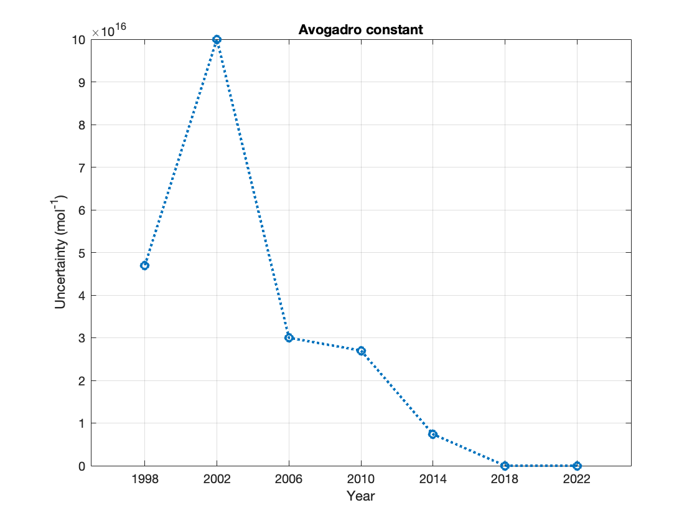

# Constants


`Constants` provides easy access to the latest internationally recommended values of nearly 150 fundamental constants from physics and chemistry, along with their uncertainties, units, names, and metadata.


## Key Features and Benefits


- **Convenience**: Retrieve constants using simple dot notation with intuitive variable names.
- **Always Up-to-Date**: No need to manually look up values -- you'll always have the latest, most accurate data.
- **Uncompromising Accuracy**: Values are automatically generated from the official [CODATA source](#background), ensuring 100% accuracy.
- **Rich Metadata**: Access properties like uncertainty, units, names, and historical data back to 1998.
- **Symbolic Math Support**: Perform arbitrary-precision calculations, unit conversions, and unit consistency checks.
- **Future-Proof**: Designed to seamlessly accommodate future datasets and higher-precision arithmetic in MATLAB.


## Basic Usage


Load constants:

```matlab
const = Constants;
```

> [!TIP]
> For easy access, save `Constants.m` to your `userpath` or [add its parent folder to the MATLAB search path](https://www.mathworks.com/help/matlab/matlab_env/add-remove-or-reorder-folders-on-the-search-path.html).

Access individual constants:

```matlab
format long;
const.R   % molar gas constant
const.NA  % Avogadro constant
```

Constants have SI units unless the variable name ends in _inUnit_:

```matlab
const.hbar             % reduced Planck constant in SI units (J s)
const.hbarineVseconds  % reduced Planck constant in eV s
```

Look up a constant:

```matlab
const.find('charge')
```

Get a list of available constants:

```matlab
const.info
```


## Advanced Usage


### Properties and Metadata


Load all properties and metadata:

```matlab
const = Constants('all');
const.me  % properties and metadata for the electron mass
```

| Property | Description |
| :--- | :--- |
| `id` | Current name (and other names, if applicable) |
| `year` | Dataset year |
| `value` | Value |
| `uncty` | Uncertainty |
| `unit` | Unit |
| `name` | Name (and other names, if applicable) in dataset |
| `isExact` | `true` if the constant is exact |
| `isIrr` | `true` if the constant is irrational and exact |
| `symvalue` | Symbolic value (*) |
| `symunit` | Symbolic unit (*)|
| `sym` | Symbolic constant with unit (*) |

(*) Requires the Symbolic Math Toolbox.

Access individual properties:

```matlab
const.me.value   % value of the electron mass
const.me.uncty   % ... its associated uncertainty
const.me.unit    % ... and units
```

Load individual properties:

```matlab
uncty = Constants('uncty');
uncty.me  % uncertainty in the value of the electron mass
```

> [!NOTE]
> The default is `value`. Calling `Constants` is equivalent to calling `Constants('value')`.


### Historic Data


Calling `Constants` with a second argument provides access to any dataset since 1998:

* `1998`
* `2002`
* `2006`
* `2010`
* `2014`
* `2018`[^1]

[^1]: At the time of writing, the 2022 dataset has not yet been released.

Load values for a specific dataset:

```matlab
const = Constants('value', '2006');
const.G  % 2006 value of the Newtonian constant of gravitation
```

Load values for the latest (most recent) dataset:

```matlab
const = Constants('value', 'latest');
const.Vm  % current value of the molar volume of an ideal gas (273.15 K, 100 kPa)
```

> [!NOTE]
> This is the default. Calling `Constants(arg1)` without a second argument is equivalent to `Constants(arg1, 'latest')`.

Load values for all datasets (from oldest to most recent):

```matlab
const = Constants('value', 'all');
const.h(1)    % 1998 value of the Planck constant
const.h(4)    % 2010 value of the Planck constant
const.h(end)  % current value of the Planck constant
```

Load all properties and metadata for all datasets:

```matlab
const = Constants('all', 'all');
const.alpha    % properties and metadata for the fine-structure constant (1998 to date)
```


### Example 1


```matlab
const = Constants('all', 'all');
plot(const.NA.year, const.NA.uncty, ':o', 'LineWidth',2);
title(const.NA.id);
xlabel('Year');
ylabel("Uncertainty (" + const.NA.unit(end) + ")");
xticks(const.NA.year);
grid on;
```



The Avogadro constant was defined as an exact value (uncertainty: 0) when the SI Units were redefined in 2017.


## Symbolic Math


`Constants` also provides symbolic representations of all values, units, and constants with units to carry out symbolic manipulations and perform calculations with arbitrary accuracy.


### `symvalue`: Symbolic Values


_Exact_ constants, whose values are _defined_ rather than experimentally determined, can be displayed with an arbitrary number of significant digits.

```matlab
symVal = Constants('symvalue', '2018');
vpa(symVal.R, 150)     % 2018 value of the molar gas constant, rounded to 150 significant digits
vpa(symVal.hbar, 150)  % 2018 value of the reduced Planck constant, rounded to 150 significant digits
```

Output:

```console
8.3144626181532399999999999999999999999986025942636401108474665474304748280360408924463157254169942689259187318384647369384765625
0.0000000000000000000000000000000001054571817646156391262428003302280744722889961594431207605200865210242417652521623612880705649658442982842269265184440305099090648037855420322457436
```

The first value, defined as $N_\textnormal{A} k$ in the 2018 dataset, is rational and has 128 significant digits. The Avogadro constant $N_\textnormal{A}$ and the Boltzmann constant $k$ are defined as exact, rational values in the dataset.

The second value, defined as $h/(2 \symup{\pi})$ in the 2018 dataset, is exact but irrational. The Planck constant $h$ has an exact, rational value in this dataset, but $\symup{\pi}$ is irrational.

> [!NOTE]
> Even the 64-bit (double precision) floating-point values (`value`) of exact constants are computed from their definitions in `Constants`. This makes `Constants` future-proof should MATLAB ever be released with support for 128-bit (quadruple precision) or 256-bit (octuple precision) arithmetic. 


### `symunit`: Symbolic Units


#### Example 2


Verify units for the Rydberg constant, given by $\frac{m_\textnormal{e} e^4}{8 \epsilon_0^2 h^3 c}$ according to the Bohr model of the H atom:

```matlab
symUnit = Constants('symunit');
simplify(symUnit.me * symUnit.e^4 / (symUnit.epsilonzero^2 * symUnit.h^3 * symUnit.c))
```

Output:

```console
1/[m]
```

> [!CAUTION]
> Choose your variable names wisely; `sym` and `symunit` are the names of commands in the Symbolic Math Toolbox!


### `sym`: Symbolic Constants


```matlab
symConst = Constants('sym');
u = symunit;
speed = unitConvert(symConst.c, u.km/u.year)  % speed of light in vacuum in km/year
double(separateUnits(speed))                  % extract value and convert to double
```

```console
(47303652362904/5)*([km]/[year_Julian])
9.460730472580801e+12
```


#### Example 3


According to Planck's blackbody radiation law, the proportionality constant between the total power flux and $T^4$ is given by $\sigma = \frac{2 \symup{\pi}^5 k^4}{15 c^2 h^3}$:

```matlab
sigma = sym('2') * sym(pi)^sym('5') * symConst.k^sym('4') / ...
(sym('15') * symConst.c^sym('2') * symConst.h^sym('3') )
% compare this with the (exact and irrational) Stefan-Boltzmann constant from 'Constants'
symConst.sigma
```

Output:

```console
0.00000000018529443369510835899732062307541*pi^5*(([Hz]^3*[J]*[s]^2)/([K]^4*[m]^2))
0.00000000018529443369510835899732062307541*pi^5*([W]/([K]^4*[m]^2))
```

The values are obviously identical. Let's check if their units match as well:

```matlab
checkUnits(sigma == symConst.sigma)
```

Output:

```console
Consistent: 0
Compatible: 0
```

MATLAB thinks they are different, perhaps because `sigma` has messy units. Let's simplify it and try again:

```matlab
sigma = simplify(sigma)
checkUnits(sigma == symConst.sigma)
```

Output:

```console
0.000000056703744191844294539709967318892*(([Hz]*[kg])/([K]^4*[s]^2))
Consistent: 1
Compatible: 1
```

We have a match!


## Background


`Constants` was built by scientists for students and researchers in the sciences and engineering with a focus on simplicity and completeness.

The internationally recommended values of the basic constants and conversion factors of physics and chemistry are established by the Committee on Data of the International Science Council's [(CODATA) Task Group on Fundamental Physical Constants](https://codata.org/initiatives/data-science-and-stewardship/fundamental-physical-constants/). CODATA recommended values are adjusted in a four-year cycle and available on the [National Institute of Standards and Technology (NIST) website](https://physics.nist.gov/cuu/Constants/). 

For each adjustment since 1998, NIST provides an ASCII file of all values. `Constants.m` is generated automatically by scraping the data from these ASCII files to avoid copy & paste errors and guarantee accuracy.


## Frequently Asked Questions


A list of [frequently asked questions](./FAQ.md) is maintained separately from this README file.


## List of Constants


| Variable | Constant | Unit |
|  :---  |  :---  |  :---  |
| `malpha` | Alpha particle mass | kg |
| `malphainu` | Alpha particle mass in u | u |
| `Malpha` | Alpha particle molar mass | kg mol<sup>-1</sup> |
| `angstromstar` | Angstrom star | m |
| `mu` | Atomic mass constant | kg |
| `NA` | Avogadro constant | mol<sup>-1</sup> |
| `muB` | Bohr magneton | J T<sup>-1</sup> |
| `muBineVpertesla` | Bohr magneton in eV/T | eV T<sup>-1</sup> |
| `azero` | Bohr radius (atomic unit of length) | m |
| `k` | Boltzmann constant | J K<sup>-1</sup> |
| `kineVperkelvin` | Boltzmann constant in eV/K | eV K<sup>-1</sup> |
| `Zzero` | Characteristic impedance of vacuum | ohm |
| `re` | Classical electron radius | m |
| `lambdaC` | Compton wavelength | m |
| `Gzero` | Conductance quantum | S |
| `KJninety` | Conventional value of Josephson constant | Hz V<sup>-1</sup> |
| `Aninety` | Conventional value of ampere-90 | A |
| `Cninety` | Conventional value of coulomb-90 | C |
| `Fninety` | Conventional value of farad-90 | F |
| `Hninety` | Conventional value of henry-90 | H |
| `Omeganinety` | Conventional value of ohm-90 | ohm |
| `Vninety` | Conventional value of volt-90 | V |
| `RKninety` | Conventional value of von Klitzing constant | ohm |
| `Wninety` | Conventional value of watt-90 | W |
| `xuCu` | Copper x unit | m |
| `gd` | Deuteron g factor | (unitless) |
| `mud` | Deuteron magnetic moment | J T<sup>-1</sup> |
| `md` | Deuteron mass | kg |
| `mdinu` | Deuteron mass in u | u |
| `Md` | Deuteron molar mass | kg mol<sup>-1</sup> |
| `rd` | Deuteron rms charge radius | m |
| `ge` | Electron g factor | (unitless) |
| `gammae` | Electron gyromagnetic ratio | s<sup>-1</sup> T<sup>-1</sup> |
| `gammaeinMHzpertesla` | Electron gyromagnetic ratio in MHz/T | MHz T<sup>-1</sup> |
| `mue` | Electron magnetic moment | J T<sup>-1</sup> |
| `ae` | Electron magnetic moment anomaly | (unitless) |
| `me` | Electron mass (atomic unit of mass, natural unit of mass) | kg |
| `meinu` | Electron mass in u | u |
| `Me` | Electron molar mass | kg mol<sup>-1</sup> |
| `eV` | Electron volt | J |
| `eVinhartree` | Electron volt-hartree relationship | E_h |
| `e` | Elementary charge (atomic unit of charge) | C |
| `F` | Faraday constant | C mol<sup>-1</sup> |
| `alpha` | Fine-structure constant | (unitless) |
| `cone` | First radiation constant | W m^2 |
| `coneL` | First radiation constant for spectral radiance | W m^2 sr<sup>-1</sup> |
| `Eh` | Hartree energy (atomic unit of energy) | J |
| `EhineV` | Hartree energy in eV | eV |
| `gh` | Helion g factor | (unitless) |
| `muh` | Helion magnetic moment | J T<sup>-1</sup> |
| `mh` | Helion mass | kg |
| `mhinu` | Helion mass in u | u |
| `Mh` | Helion molar mass | kg mol<sup>-1</sup> |
| `sigmah` | Helion shielding shift | (unitless) |
| `DeltanuCs` | Hyperfine transition frequency of Cs-133 | Hz |
| `KJ` | Josephson constant | Hz V<sup>-1</sup> |
| `jouleineV` | Joule-electron volt relationship | eV |
| `jouleinhartree` | Joule-hartree relationship | E_h |
| `kginu` | Kilogram-atomic mass unit relationship | u |
| `a` | Lattice parameter of silicon | m |
| `dtwotwozero` | Lattice spacing of ideal Si (220) | m |
| `nzero` | Loschmidt constant (273.15 K, 100 kPa) | m<sup>-3</sup> |
| `nzeroSTPold` | Loschmidt constant (273.15 K, 101.325 kPa) | m<sup>-3</sup> |
| `Kcd` | Luminous efficacy | lm W<sup>-1</sup> |
| `Phizero` | Magnetic flux quantum | Wb |
| `R` | Molar gas constant | J mol<sup>-1</sup> K<sup>-1</sup> |
| `Mu` | Molar mass constant | kg mol<sup>-1</sup> |
| `MtwelveC` | Molar mass of carbon-12 | kg mol<sup>-1</sup> |
| `Vm` | Molar volume of ideal gas (273.15 K, 100 kPa) | m^3 mol<sup>-1</sup> |
| `VmSTPold` | Molar volume of ideal gas (273.15 K, 101.325 kPa) | m^3 mol<sup>-1</sup> |
| `VmSi` | Molar volume of silicon | m^3 mol<sup>-1</sup> |
| `xuMo` | Molybdenum x unit | m |
| `lambdaCmu` | Muon Compton wavelength | m |
| `gmu` | Muon g factor | (unitless) |
| `mumu` | Muon magnetic moment | J T<sup>-1</sup> |
| `amu` | Muon magnetic moment anomaly | (unitless) |
| `mmu` | Muon mass | kg |
| `mmuinu` | Muon mass in u | u |
| `Mmu` | Muon molar mass | kg mol<sup>-1</sup> |
| `lambdaCn` | Neutron Compton wavelength | m |
| `gn` | Neutron g factor | (unitless) |
| `gamman` | Neutron gyromagnetic ratio | s<sup>-1</sup> T<sup>-1</sup> |
| `gammaninMHzpertesla` | Neutron gyromagnetic ratio in MHz/T | MHz T<sup>-1</sup> |
| `mun` | Neutron magnetic moment | J T<sup>-1</sup> |
| `mn` | Neutron mass | kg |
| `mninu` | Neutron mass in u | u |
| `Mn` | Neutron molar mass | kg mol<sup>-1</sup> |
| `G` | Newtonian constant of gravitation | m^3 kg<sup>-1</sup> s<sup>-2</sup> |
| `muN` | Nuclear magneton | J T<sup>-1</sup> |
| `muNineVpertesla` | Nuclear magneton in eV/T | eV T<sup>-1</sup> |
| `h` | Planck constant | J Hz<sup>-1</sup> |
| `hineVperhertz` | Planck constant in eV/Hz | eV Hz<sup>-1</sup> |
| `lP` | Planck length | m |
| `mP` | Planck mass | kg |
| `TP` | Planck temperature | K |
| `tP` | Planck time | s |
| `lambdaCp` | Proton Compton wavelength | m |
| `gp` | Proton g factor | (unitless) |
| `gammap` | Proton gyromagnetic ratio | s<sup>-1</sup> T<sup>-1</sup> |
| `gammapinMHzpertesla` | Proton gyromagnetic ratio in MHz/T | MHz T<sup>-1</sup> |
| `mup` | Proton magnetic moment | J T<sup>-1</sup> |
| `sigmapprime` | Proton magnetic shielding correction | (unitless) |
| `mp` | Proton mass | kg |
| `mpinu` | Proton mass in u | u |
| `Mp` | Proton molar mass | kg mol<sup>-1</sup> |
| `rp` | Proton rms charge radius | m |
| `lambdabarC` | Reduced Compton wavelength (natural unit of length) | m |
| `hbar` | Reduced Planck constant (atomic unit of action, natural unit of action) | J s |
| `hbarineVseconds` | Reduced Planck constant in eV s (natural unit of action in eV s) | eV s |
| `lambdabarCmu` | Reduced muon Compton wavelength | m |
| `lambdabarCn` | Reduced neutron Compton wavelength | m |
| `lambdabarCp` | Reduced proton Compton wavelength | m |
| `lambdabarCtau` | Reduced tau Compton wavelength | m |
| `Rinfinity` | Rydberg constant | m<sup>-1</sup> |
| `ctwo` | Second radiation constant | m K |
| `gammahprime` | Shielded helion gyromagnetic ratio | s<sup>-1</sup> T<sup>-1</sup> |
| `gammahprimeinMHzpertesla` | Shielded helion gyromagnetic ratio in MHz/T | MHz T<sup>-1</sup> |
| `muhprime` | Shielded helion magnetic moment | J T<sup>-1</sup> |
| `gammapprime` | Shielded proton gyromagnetic ratio | s<sup>-1</sup> T<sup>-1</sup> |
| `gammapprimeinMHzpertesla` | Shielded proton gyromagnetic ratio in MHz/T | MHz T<sup>-1</sup> |
| `mupprime` | Shielded proton magnetic moment | J T<sup>-1</sup> |
| `sigmadp` | Shielding difference of d and p in HD | (unitless) |
| `sigmatp` | Shielding difference of t and p in HT | (unitless) |
| `c` | Speed of light in vacuum (natural unit of velocity) | m s<sup>-1</sup> |
| `gzero` | Standard acceleration of gravity | m s<sup>-2</sup> |
| `atm` | Standard atmosphere | Pa |
| `ssp` | Standard-state pressure | Pa |
| `sigma` | Stefan-Boltzmann constant | W m<sup>-2</sup> K<sup>-4</sup> |
| `lambdaCtau` | Tau Compton wavelength | m |
| `mtau` | Tau mass | kg |
| `mtauinu` | Tau mass in u | u |
| `Mtau` | Tau molar mass | kg mol<sup>-1</sup> |
| `sigmae` | Thomson cross section | m^2 |
| `gt` | Triton g factor | (unitless) |
| `mut` | Triton magnetic moment | J T<sup>-1</sup> |
| `mt` | Triton mass | kg |
| `mtinu` | Triton mass in u | u |
| `Mt` | Triton molar mass | kg mol<sup>-1</sup> |
| `u` | Unified atomic mass unit | kg |
| `epsilonzero` | Vacuum electric permittivity | F m<sup>-1</sup> |
| `muzero` | Vacuum magnetic permeability | N A<sup>-2</sup> |
| `RK` | Von Klitzing constant | ohm |
| `sinsquaredthetaW` | Weak mixing angle | (unitless) |
| `bprime` | Wien frequency displacement law constant | Hz K<sup>-1</sup> |
| `b` | Wien wavelength displacement law constant | m K |